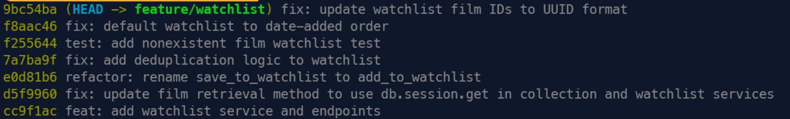

# PR Response Doc — CineLog Watchlist Feature

## AI Usage
- I used AI to help me understand the structure of the CineLog codebase. I also used AI to understand the Flask request flow. It explained that the route receives the HTTP request, calls the service function, and converts service errors into HTTP responses. This helped me understand why adding `AlreadyInWatchlistError` in the service also required the watchlist route to handle that error and return a `409` response. I verified this against the existing collection route pattern and ran the test suite after my changes.
- For Comments 4 and 5, I asked AI to stress-test my reasoning and identify counterarguments or tradeoffs I might have missed. Based on the feedback, I added a clearer privacy tradeoff to Comment 4 and added the main benefit of alphabetical sorting to Comment 5 before finalizing my responses.
- For Comment 6, I used AI to help me inspect the rebase after Git reported that it completed successfully. I did not know what had changed, so AI showed me how to use `ORIG_HEAD`, `git diff`, and `git diff --stat` to compare the branch before and after the rebase. I learned that Git can complete a rebase without showing a text conflict even when there is still a logical problem.
- Used AI to review the manual testing flow against the current code. It identified that `FilmNotFoundError` was not handled by the watchlist route, which would cause a `500` response instead of `404`. I verified the issue in the code, added the missing exception handling, reran the tests, and revised the Manual Testing instructions to be platform-neutral.

## Comment 1 — Rename
**What I did:** I renamed `save_to_watchlist()` to `add_to_watchlist()` in `services/watchlist_service.py` to follow the project's `verb_to_noun` naming convention. I then used a repository-wide search for `save_to_watchlist` and found the related import and function call in `routes/watchlist/watchlist.py`. I updated those references and the service function's docstring.

**How I verified:** I searched the entire repository again for `save_to_watchlist` and confirmed that no references to the old name remained. I also ran the existing test suite and confirmed that all tests passed.

## Comment 2 — Deduplication
**What I did:** I updated `add_to_watchlist()` to query for an existing `WatchlistEntry` with the same `user_id` and `film_id` before creating a new entry. If an entry already exists, the service raises `AlreadyInWatchlistError` instead of creating a duplicate. I also updated the watchlist route to handle that error.

**How I verified:** I followed the existing deduplication pattern in `add_to_collection()`, which queries for an existing entry before creating a new one and raises a specific error when a duplicate is found. I also ran the full existing test suite to confirm that the change did not break existing behavior.

## Comment 3 — Missing test
**What I did:** I added `tests/test_watchlist.py` with a test that calls `add_to_watchlist()` using a film ID that does not exist in the database and verifies that `FilmNotFoundError` is raised.

**How I verified:** I used `test_add_to_collection_nonexistent_film_raises()` in `tests/test_collection.py` as the model for the new test, including its fixture structure. I ran the new watchlist test and the full test suite, and all tests passed.

**How I verified:** I used `test_add_to_collection_nonexistent_film_raises()` in `tests/test_collection.py` as the model for the new test, including its fixture structure and use of `pytest.raises(FilmNotFoundError)`. I ran the new watchlist test and the full test suite, and all tests passed.

## Comment 4 — Default visibility
**My position:** I would keep watchlist entries public by default.

**Reasoning:** In `README.md` CineLog is described as a community film tracking app, so public watchlists support the its social purpose by making it easier for users to share interests, discuss films, and discover titles through other users. Also, for an early version of the product, this default also encourages visible participation and helps establish an active community.

**Tradeoff acknowledged:** A community-focused product does not automatically mean that every user expects their watchlist to be public. A private default would better protect users who do not notice or understand the visibility setting. However, I would still keep the public default because sharing and discovery are central to CineLog's current product direction. A future improvement should make visibility clear and allow users to change it easily.

## Comment 5 — Sort order
**My position:** I agree that watchlists should default to date-added order

**Reasoning:** This order makes recent actions easier to manage. For example, a user can quickly find films they added today, review their latest additions, or remove several films they just added without having to remember every title. This reduces the memory burden placed on the user.

**Engagement with reviewer's point:** I agree that most users are more likely to review recent additions than browse their entire watchlist alphabetically. Alphabetical ordering provides a stable and predictable order, but it is mainly useful when the user already remembers the beginning of a title. A user looking for a specific visible title may also use the browser's page search. Date-added order better supports the common task of managing recent additions, so I would use it as the default.

## Comment 6 — Rebase
**What conflicted:** I rebased `feature/watchlist` onto `origin/main`. The main branch had changed film IDs from integers to UUID strings. Git did not show a conflict during the rebase, but after the rebase, the `WatchlistEntry` model was missing from `models.py`. Because of this, the watchlist test had an error when it tried to import `WatchlistEntry`.

**How I resolved it:** I restored the `WatchlistEntry` model in `models.py` and updated its `film_id` column to use `db.String(36)` so that it matches the UUID type used by `Film.id`. I also updated the old comments that still said the film ID was an integer to UUID strings. 

**How I verified no conflict remains:** I ran the full test suite after the fix and confirmed that all 5 tests passed.

## PR Description
**Feature overview:**
This PR adds a watchlist feature that lets users save films they want to watch later and view their saved films. It also prevents duplicate entries, handles nonexistent film IDs, and supports UUID film IDs.

**Design decisions:**  
Watchlist entries are public by default to support sharing and film discovery in CineLog. Watchlists are sorted by date-added, so users can easily find their recent additions.

**Manual Testing:**
Prerequisites: a `User` row and at least two `Film` rows must already exist in the database. Use `GET /films/` to find existing film UUIDs, and use a Flask shell to create or retrieve a user and create films if needed. Reference them below as `<user_id>`, `<film_id_1>`, and `<film_id_2>`.
1. **Add a film to the watchlist**
   - Request: `POST /watchlist/<user_id>/add`, body `{"film_id": "<film_id_1>"}`
   - Expected: `201 Created`, response body is the new entry with `"public": true` — confirms the public-by-default design decision.
2. **Attempt a duplicate add**
   - Request: repeat step 1 with the same `user_id` and `film_id_1`.
   - Expected: `409 Conflict`, no second entry created — confirms the deduplication logic from Comment 2.
3. **Add a second film and check sort order**
   - Request: `POST /watchlist/<user_id>/add`, body `{"film_id": "<film_id_2>"}`, then `GET /watchlist/<user_id>`.
   - Expected: both films returned, most recently added first — confirms the date-added sort order design decision.
4. **Add a nonexistent film**
   - Request: `POST /watchlist/<user_id>/add`, body `{"film_id": "00000000-0000-0000-0000-000000000000"}`.
   - Expected: `404 Not Found`.
5. **Run the automated test suite**
   - `pytest tests/` — all tests should pass.

## Commit History

